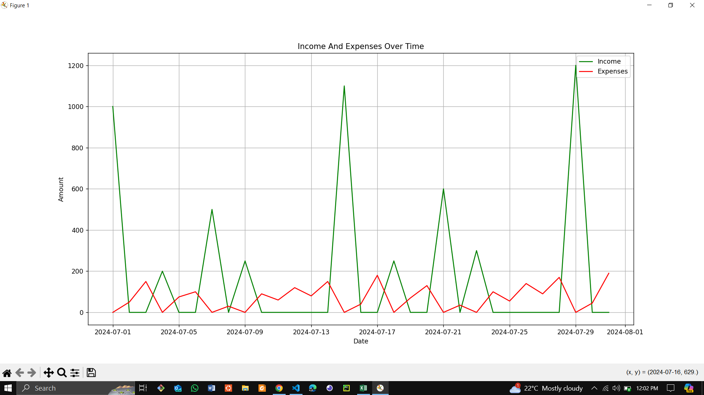

# Personal Finance Tracker

This project is a personal finance tracker that helps you manage your income and expenses. The tracker allows you to add transactions, view transactions within a specified date range, and plot a graph of your income and expenses over time.



## Requirements

- pandas
- matplotlib

You can install these packages using pip:

```sh
pip install pandas matplotlib
```

## How to Run

The project runs on the console. The main entry point of the application is main.py. To run the program, execute the following command:

```sh
python main.py
```

## Features

Add a New Transaction: Allows you to add a new transaction by entering the date, amount, category, and description.

View Transactions: Displays all transactions within a specified date range, along with a summary of total income and expenses.

Plot Graph: Plots a graph of your income and expenses over the specified date range.

## Code Overview

### CSV Class

The CSV class handles the following tasks:

Initializing the CSV file (initialize_csv)

Adding new entries to the CSV file (add_entries)

Retrieving transactions within a specified date range (get_transactions)

### Functions

add(): Collects transaction data from the user and adds it to the CSV file.

plot_transactions(dataframe): Plots a graph of income and expenses over time.

main(): The main function that provides a menu for the user to interact with the program.
